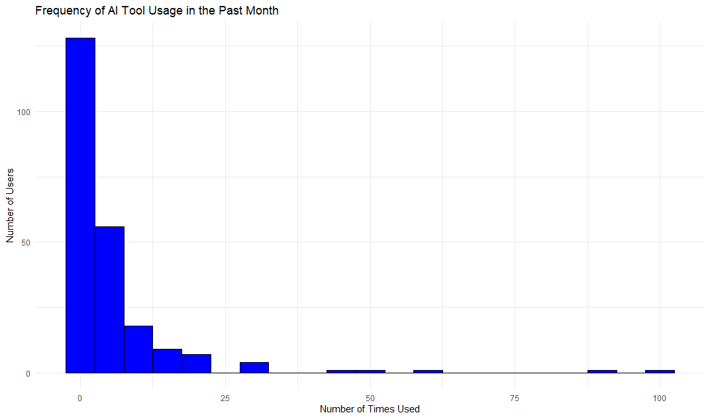
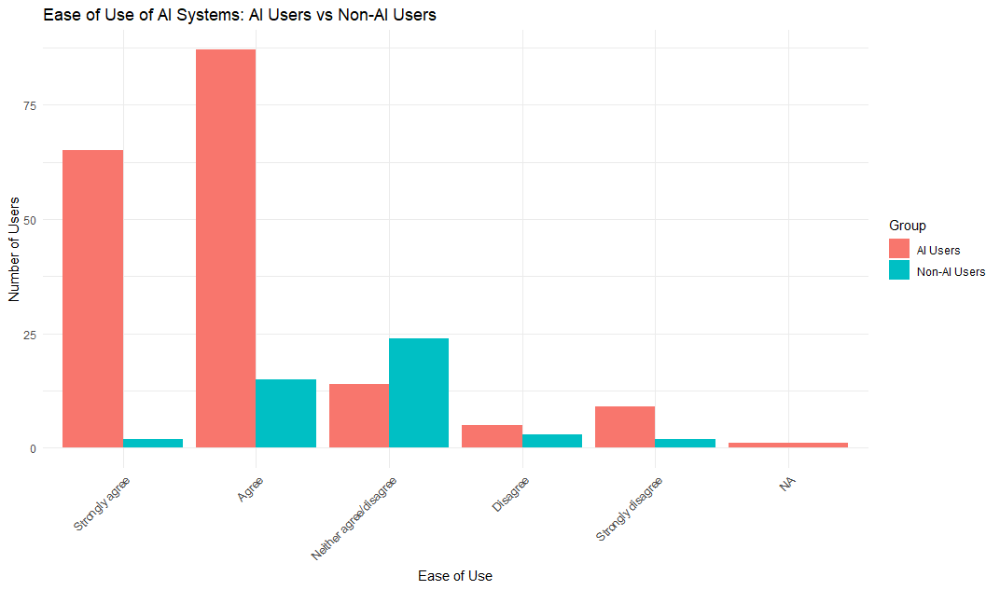
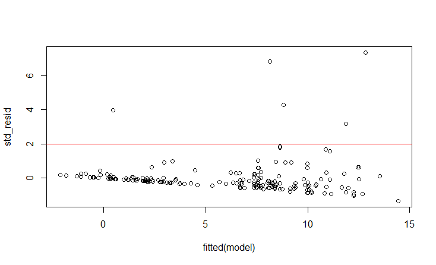

# AI Adoption and Perception Analysis

This project analyses survey data on AI tool adoption and user perceptions using R. The analysis includes data cleaning, exploratory data analysis, visualisation and multiple linear regression modelling.

The project uses `dplyr` for data manipulation, `ggplot2` for visualisation and base R functions statistical modelling.

## Project Objectives

- Data cleaning and imputation
- Exploratory data analysis 
- Predictive modelling 
 
## Tech Stack and Libraries

- **Language:** R
- **Data manipulation:** `dplyr`, `readr`
- **Visualisation:** `ggplot2`

## Key Findings

1. **AI tool adoption**  
   ChatGPT was the most commonly used AI tool in the survey, with 175 respondents reporting its use. Overall usage was task-specific, and most respondents used AI tools infrequently, producing a right-skewed distribution.

2. **User perception**  
   Positive responses were closely linked to perceived ease of use. Respondents who did not use AI tools showed greater scepticism about the reliability of AI-generated information.

3. **Regression results**  
   The multiple linear regression model found that perceived learning support, measured through `AIHelpsMeLearn`, was the strongest statistically significant predictor of AI usage frequency (`p < 0.001`). This suggests that perceived usefulness for learning had more influence on usage than demographic variables such as age or year of study.

## Visual Insights

### 1. Frequency of AI Tool Usage

The distribution of AI usage is right-skewed, showing that most respondents used AI tools relatively infrequently, typically between 0 and 5 times per month.

  

### 2. User Perception: Ease of Use

Respondents who used AI tools reported higher perceived ease of use than non-users. This suggests that direct experience with AI tools may reduce uncertainty and make the tools feel easier to use.

  

### 3. Model Evaluation: Standardised Residuals

Outliers with an absolute standardised residual value greater than 2 were identified and removed before finalising the multiple linear regression model. This helped reduce the influence of unusually large residuals on the model results.

  

